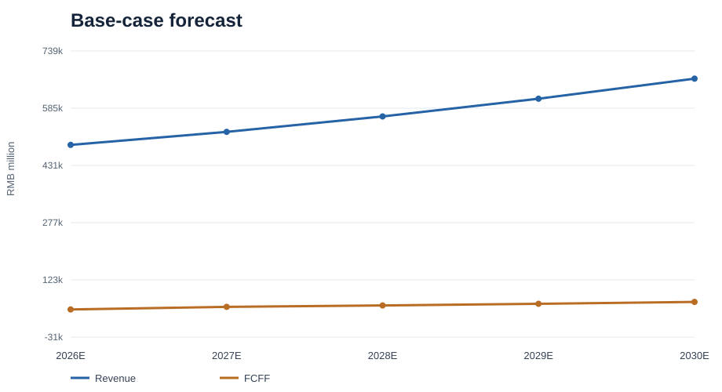
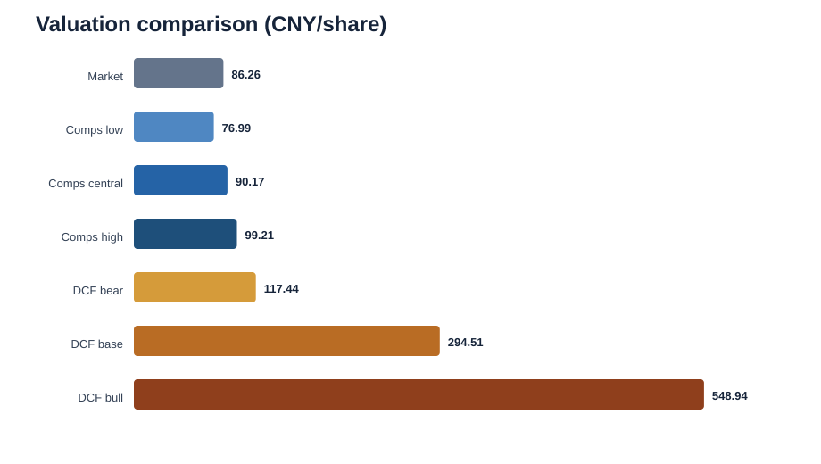

# Midea Group — Final Results and Findings

## 1. Executive Summary

This project develops an integrated three-statement forecast and valuation of **Midea Group** for **2026E–2030E**. Company operating information is limited to information available by **20 August 2026**; valuation market data are dated **11 September 2026**. The primary method is an FCFF discounted cash-flow valuation. Period-aligned trading comparables provide a secondary reference, while reverse DCF, scenario analysis, and a WACC–terminal-growth sensitivity matrix test the interpretation.

| Result | Model-derived value |
|---|---:|
| Market price | CNY 86.26/share |
| DCF base | CNY 294.51/share |
| Comparable-company central value | CNY 90.17/share |
| Base WACC | 5.2666% |
| Terminal value / enterprise value | 88.8% |
| Risk | HIGH |
| Confidence | LOW TO MEDIUM |
| Final interpretation | DCF indicates upside, but confidence is low to medium |

The base DCF sits materially above both the market price and the comparable-company range. That result is a **model-implied valuation**, not a guaranteed target price. Approximately 88.8% of base enterprise value comes from terminal value, and the comparables cluster much closer to the market price. The evidence therefore supports an informative upside signal with high valuation risk rather than a high-conviction claim of undervaluation.



## 2. Research Question and Objective

The central question is: **what equity value per share follows from a source-bound operating forecast, a market-consistent cost of capital, and explicit controls over cash, debt, working capital, and share mechanics?** The project also asks what the observed market price implies about future cash flows and whether a period-consistent peer valuation supports or challenges the DCF signal.

## 3. Data, Sources and Information Cutoff

The model uses audited annual reports, interim disclosures, event notices, market observations, Damodaran country-risk data, ChinaBond yields, and peer financial/market data. The [source registry](../data/FINAL_SOURCE_REGISTRY_R3.csv) records publisher, document, dates, URL, archived-file hash, observation, transformation, allowed use, and distribution status. Provider-controlled material is referenced rather than redistributed where public inclusion is inappropriate.

The **model-information cutoff is 20 August 2026**. The **valuation market-data date is 11 September 2026**. Post-cutoff market observations may support valuation inputs, but no post-cutoff company operating fact enters the forecast. Values retain source-native precision; displayed rounding does not imply unsupported precision.

## 4. Model Architecture

The model links historical statements, the 2026 Q1 bridge, segment drivers, three financial statements, debt and PPE schedules, equity and cash roll-forwards, economic operating working capital, FCFF, WACC, DCF, reverse DCF, comparables, and final synthesis. The calculation database is [SQLite](../model/MIDEA_GROUP_FINAL_MODEL_R3.sqlite); the review model is [Excel](../excel/MIDEA_GROUP_INSTITUTIONAL_MODEL_R3.xlsx). Formula lineage and validation are described in [model architecture](model_architecture.md) and [methodology](methodology.md).

## 5. Historical Financial and Forecast Findings

**Historical observation.** 2025 revenue was RMB 456,451.731 million and attributable net income was RMB 43,945.411 million. The historical balance sheet carried substantial cash and investment assets alongside debt and operating liabilities.

**Forecast assumption.** Segment revenue, operating costs, margins, investment, and working-capital accounts follow governed drivers rather than balancing plugs. Scenario differences affect operating performance, cash conversion, WACC, and terminal assumptions.

**Model output.** Base revenue rises from RMB 485,985.020 million in 2026E to RMB 664,184.627 million in 2030E, a CAGR of 8.12%. EBIT rises from RMB 49,562.973 million to RMB 62,861.970 million, while the EBIT margin moves from 10.20% to 9.46%. Attributable net income increases from RMB 43,195.616 million to RMB 55,835.340 million. EPS rises from CNY 5.84 to CNY 7.54, using the governed accounting share population.

## 6. Segment Forecast Findings

The forecast segments are Smart Home, Building Technology, Industrial Technology, Other, and Eliminations. Smart Home remains the largest modeled segment, increasing from RMB 348,791.072 million in 2026E to RMB 476,684.791 million in 2030E. Building Technology grows from RMB 40,838.199 million to RMB 55,812.634 million, and Industrial Technology from RMB 29,780.139 million to RMB 40,699.835 million.

The 2026 Q1 disclosure taxonomy is not assumed to be identical to the annual segment taxonomy. The [Q1 disclosure-to-forecast bridge](../model/H3B_Q1_DISCLOSURE_TO_FORECAST_TAXONOMY_BRIDGE.csv) maps compatible categories, documents transformations, and preserves categories that cannot be treated as directly comparable.

## 7. Operating Working Capital and FCFF

Operating NWC follows economic substance. The asset population comprises accounts receivable, notes receivable, receivables financing, inventory, contract assets, prepayments, other receivables, and other operating current assets. The liability population comprises accounts payable, contract liabilities, notes payable, employee compensation, other payables, other operating current liabilities, and other taxes payable.

Income-tax payable is excluded because NOPAT already reflects accrual income tax. Receivables financing is an operating NWC asset and is therefore **not added again** in the EV-to-equity bridge. Financial-services net investment is calculated separately from operating NWC.

| Period | Operating NWC (RMB m) | Annual ΔNWC (RMB m) |
|---|---:|---:|
| 2025A | -131,003.796 | -7,050.868 |
| 2026E | -133,300.171 | -2,296.375 |
| 2027E | -141,659.798 | -8,359.627 |
| 2028E | -152,101.160 | -10,441.363 |
| 2029E | -164,406.810 | -12,305.650 |
| 2030E | -178,480.724 | -14,073.913 |

Negative operating NWC means the modeled operating-liability population exceeds operating-current-asset requirements. Increasingly negative NWC releases cash in the base forecast; this is an important FCFF driver and a material execution risk if supplier, customer-advance, or inventory dynamics differ.

| Year | EBIT | NOPAT | D&A | Capex | ΔOperating NWC | ΔFinancial-services net investment | FCFF |
|---|---:|---:|---:|---:|---:|---:|---:|
| 2026E | 49,562.973 | 42,001.372 | 8,686.476 | 8,741.568 | -2,296.375 | 770.003 | 43,472.652 |
| 2027E | 51,502.148 | 43,644.696 | 8,959.380 | 9,670.154 | -8,359.627 | 912.213 | 50,350.502 |
| 2028E | 54,470.073 | 46,159.817 | 9,386.620 | 10,652.144 | -10,441.363 | 1,084.306 | 54,197.543 |
| 2029E | 58,289.392 | 49,396.440 | 9,947.189 | 11,704.853 | -12,305.650 | 1,245.559 | 58,626.543 |
| 2030E | 62,861.970 | 53,271.400 | 10,628.965 | 12,842.356 | -14,073.913 | 1,404.008 | 63,639.582 |

All amounts are RMB million. FCFF equals NOPAT plus depreciation and amortization, less capex, less the change in operating NWC, and less the change in financial-services net investment. Base FCFF increases from RMB 43,472.652 million in 2026E to RMB 63,639.582 million in 2030E.

## 8. Cost of Capital

The cost of equity follows:

**Cost of Equity = Rf + Beta × ERP**

The WACC follows:

**WACC = E/V × CoE + D/V × CoD × (1 − T)**

| Input or output | Value |
|---|---:|
| Risk-free rate | 1.6899% |
| Beta | 0.7855 |
| Equity risk premium | 5.0728% |
| Cost of equity | 5.6745% |
| Pre-tax cost of debt | 1.7292% |
| Tax rate | 15.2566% |
| Equity weight | 90.31% |
| Debt weight | 9.69% |
| WACC low | 5.0776% |
| WACC base | 5.2666% |
| WACC high | 7.0262% |

The low case uses the CDS-based ERP alternative with the base beta. The base case uses the rating-based China ERP and recomputed beta. The high case uses the upper 95% beta confidence bound with the base ERP. This range is evidence-based rather than an arbitrary spread around the base rate.

## 9. Discounted Cash Flow Valuation

The explicit period covers 2026E–2030E. Each scenario discounts scenario-specific FCFF and applies its own WACC and terminal-growth rate. Enterprise value is converted to equity value through the governed bridge and divided by the corresponding share denominator.

| Scenario | WACC | Terminal growth | PV explicit FCFF (RMB m) | PV terminal value (RMB m) | Enterprise value (RMB m) | Equity value (RMB m) | CNY/share |
|---|---:|---:|---:|---:|---:|---:|---:|
| Bear | 7.0262% | 1.50% | 154,874.0 | 588,623.1 | 743,497.1 | 869,340.0 | 117.44 |
| Base | 5.2666% | 2.50% | 230,179.4 | 1,824,096.2 | 2,054,275.7 | 2,180,118.6 | 294.51 |
| Bull | 5.0776% | 3.00% | 326,274.4 | 3,611,393.9 | 3,937,668.4 | 4,063,511.3 | 548.94 |



## 10. DCF Sensitivity Analysis

The base-case sensitivity spans CNY 149.16 to CNY 380.99 per share.

| WACC \ Terminal growth | 1.00% | 1.50% | 2.00% | 2.50% | 3.00% |
|---|---:|---:|---:|---:|---:|
| 5.0776% | 214.50 | 238.67 | 270.70 | 315.15 | 380.99 |
| 5.1721% | 209.92 | 232.85 | 263.01 | 304.46 | 365.00 |
| 5.2666% | 205.54 | 227.32 | 255.78 | 294.51 | 350.34 |
| 6.1464% | 172.52 | 186.68 | 204.26 | 226.65 | 256.17 |
| 7.0262% | 149.16 | 159.00 | 170.80 | 185.20 | 203.17 |

Lower WACC and higher terminal growth increase present value, while higher WACC and lower growth reduce it. The matrix should be read as a range of outcomes under alternative assumptions, not as separate price targets. The formula-linked [Excel model](../excel/MIDEA_GROUP_INSTITUTIONAL_MODEL_R3.xlsx) and [dashboard](../dashboard/app.py) provide the full calculation context.

## 11. Reverse DCF — What the Market Price Implies

At CNY 86.26 per share, the governed reverse DCF targets equity value of RMB 638,540.828 million and enterprise value of RMB 512,697.877 million. Holding the base WACC and base terminal-growth framework where specified, the market price corresponds to a uniform FCFF scale of 24.96% of the base forecast and implied 2030 FCFF of RMB 15,882.912 million. The alternative implied terminal-growth solution is -10.36%.

The negative implied growth is not a literal prediction. It is a diagnostic showing how far market-implied cash-flow economics sit below the project's base forecast under the model's governed setup.

## 12. Comparable-Company Valuation

Core peers are Gree, Haier Smart Home, Hisense Home Appliances. Secondary peers are Carrier Global, Daikin Industries, Panasonic Holdings. Schneider Electric, Siemens, Abb are retained as reference-only observations because their business mix is less comparable. Selected peer financials use source-native TTM periods to the latest available quarter; Midea denominators use compatible LTM metrics to 31 March 2026. P/B uses point-in-time book equity. EBITDA remains reference-only because a compatible Midea LTM EBITDA denominator is unavailable.

| Multiple | Selected value | Use |
|---|---:|---|
| EV/Revenue | 1.06x | Implied value |
| EV/EBITDA | 7.40x | Reference only |
| EV/EBIT | 11.23x | Implied value |
| P/E | 17.57x | Implied value |
| P/B | 1.88x | Implied value |

| Method | Implied CNY/share |
|---|---:|
| EV/Revenue | 83.04 |
| EV/EBIT | 97.30 |
| P/E | 104.92 |
| P/B | 58.86 |
| Comps low | 76.99 |
| Comps central | 90.17 |
| Comps high | 99.21 |

## 13. Why DCF and Comparable Companies Differ

**Fact.** The market price is CNY 86.26; the comparables central value is CNY 90.17; the base DCF is CNY 294.51. Approximately 88.8% of base DCF enterprise value is terminal value.

**Interpretation.** The DCF capitalizes the project's long-run FCFF assumptions, whereas comparables reflect current peer-market pricing and observed TTM financials. Dispersion may reflect terminal-value concentration, different market-implied growth, Midea's mix of appliances and industrial/building businesses, cash and investment assets, margin expectations, or the prevailing China equity valuation regime. The evidence does not isolate one definitive explanation; the gap itself is a central risk signal.

## 14. Enterprise-to-Equity Bridge

| Included bridge item | Signed amount (RMB m) | Treatment |
|---|---:|---|
| Enterprise Value | 2,054,275.661 | DCF output |
| Excess cash equivalents | 30,690.395 | Cash equivalents above evidence-derived minimum historical cash/revenue operating reserve |
| Term deposits | 11,942.612 | Separately identified liquid treasury investment |
| Non-operating financial investments | 10,271.850 | Separate investment assets outside operating FCFF |
| Interest-bearing debt | -68,515.077 | H2 2026Q1 debt plus May 2026 convertible-bond carrying amounts |
| Current fixed-income treasury products | 155,362.528 | 2025 CAS note 9 identifies current other non-current assets as treasury products. |
| Fund-investor financial liability | -706.439 | 2025 CAS current-liability disclosure; excluded from operating NWC and deducted from EV. |
| Non-controlling interests | -13,202.918 | Enterprise value includes consolidated subsidiaries |
| Equity Value | 2,180,118.612 | EV plus included signed adjustments |

Cash equivalents above the historical minimum operating-cash reserve are added as excess cash. Term deposits, fixed-income treasury products, and identified non-operating financial investments are added where available to equity holders. Debt, trading financial liabilities, and non-controlling interests are deducted. Restricted cash and the operating-cash reserve are not added. Receivables financing remains in operating NWC and is excluded from the bridge, preventing double counting.

## 15. Final Valuation Interpretation

The base DCF indicates substantial model-implied upside of 241.4% relative to the 11 September 2026 market price. However, the DCF is highly dependent on terminal value and sits materially above the period-aligned comparable-company range. The DCF signal is therefore treated as informative rather than high conviction, with **high valuation risk** and **low-to-medium confidence**. No mechanical average is imposed across methods.

## 16. Principal Risks

- Terminal-value dependence and sensitivity to WACC and long-run growth.
- Forecast uncertainty across the China appliance cycle and international demand.
- Margin pressure from competition, commodity costs, product mix, and FX.
- Working-capital absorption if operating-liability funding or inventory discipline weakens.
- Capital-allocation and M&A outcomes that differ from modeled returns.
- Peer comparability and market-regime risk in relative valuation.
- Cost-of-capital changes after the valuation date.

## 17. Potential Catalysts

- Sustained smart-home mix improvement.
- Building-technology growth.
- Recovery in industrial technology.
- Stronger FCFF conversion than market-implied expectations.
- Disciplined capital returns and operating-margin improvement.

These are potential model-supported catalysts, not guaranteed events.

## 18. Thesis Breakers

- FCFF persistently below the bear case.
- Structural EBIT-margin compression.
- Working-capital absorption above the governed range.
- Unexpected leverage increases.
- Capital allocation that erodes returns.
- Long-run growth assumptions becoming economically unsupported.

## 19. Key Findings

1. Base revenue grows at 8.12% annually from 2026E to 2030E.
2. Base FCFF rises from RMB 43,472.7 million to RMB 63,639.6 million.
3. Negative operating NWC is a meaningful financing source; deterioration in that structure is a key cash-flow risk.
4. The base WACC is 5.2666%, with an evidence-based range of 5.0776%–7.0262%.
5. DCF values span CNY 117.44–548.94 per share across governed scenarios.
6. The base sensitivity matrix spans CNY 149.16–380.99 per share.
7. The comparables range of CNY 76.99–99.21 sits close to the market price and far below the base DCF.
8. Reverse DCF implies materially lower cash-flow economics than the base forecast.
9. Terminal value contributes 88.8% of base enterprise value, limiting confidence.
10. The combined evidence supports upside under the model while retaining high risk and low-to-medium confidence.

## 20. Project Outputs

- [Excel model](../excel/MIDEA_GROUP_INSTITUTIONAL_MODEL_R3.xlsx): formula-linked review model and sensitivity tables.
- [SQLite model](../model/MIDEA_GROUP_FINAL_MODEL_R3.sqlite): canonical structured calculation and output store.
- [Interactive dashboard source](../dashboard/app.py): read-only scenario exploration and live model checks.
- [Valuation report](../reports/MIDEA_GROUP_FINAL_VALUATION_REPORT_R3.docx): formal report deliverable.
- [Investment memo](../reports/MIDEA_GROUP_INVESTMENT_MEMO_R3.pdf): concise investment-oriented synthesis.
- [Source registry](../data/FINAL_SOURCE_REGISTRY_R3.csv): source provenance and transformation register.
- [Workpapers](../workpapers/): NWC, beta, ERP, cost of debt, capital structure, cash reserve, comparable periods, and synthesis.
- [Verification](../verification/): public verifier, independent recalculator, end-to-end checks, cleanroom evidence, and mutation tests.

## 21. Reproducibility

From the repository root:

```bash
python -m pip install -r requirements.txt
python -B verification/final_calculation_verifier.py
python -B verification/independent_model_recalculator.py
python -B verification/end_to_end_verifier.py
python -B -m pytest tests/test_repository.py
streamlit run dashboard/app.py
```

See [reproducibility instructions](reproducibility.md) and the [data policy](../data/README.md).

## 22. Interactive Dashboard

The Streamlit dashboard opens locally at `http://localhost:8501`. It reads the certified SQLite model in read-only mode, offers governed Bear/Base/Bull scenarios, and displays forecast, WACC, DCF, sensitivity, reverse DCF, comparables, synthesis, and model-verification sections. It does not imply public hosting.

## 23. Validation and Independent Recalculation

The public financial verifier executes 375 controls covering statements, EPS, operating NWC, FCFF, WACC, DCF, EV-to-equity, comparables, and authority consistency. A separate independent recalculator does not import production calculation functions. End-to-end verification checks repository integrity and external-path independence. The live-dashboard audit confirms scenario isolation, read-only data access, zero material mismatches, and cleanroom reproduction.

## 24. Limitations

- Forecasts depend on assumptions and are not statements of future fact.
- Company operating information after 20 August 2026 is excluded.
- Market inputs are observed at 11 September 2026 and will change over time.
- Terminal value dominates the base DCF, increasing sensitivity.
- Peer accounting remains source-native; comparability is improved but not perfect.
- A compatible Midea LTM EBITDA denominator was unavailable, so EV/EBITDA is reference-only.
- Some third-party source payloads are not redistributed; provenance and hashes remain in the registry.
- The analysis is academic and does not constitute investment advice.

## 25. Methods Demonstrated

The project demonstrates source reconciliation, three-statement forecasting, segment modeling, economic NWC classification, FCFF construction, beta estimation, market-value WACC, scenario DCF, sensitivity analysis, reverse DCF, period-aligned trading comparables, EV-to-equity reconciliation, formula-linked Excel modeling, SQLite-based outputs, interactive visualization, provenance governance, independent recalculation, and reproducible public verification.
